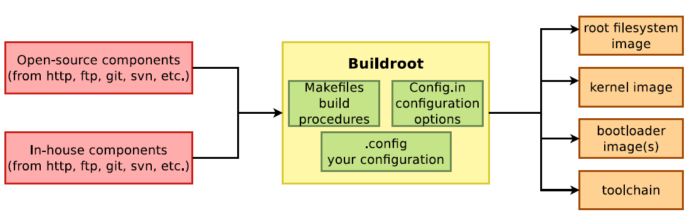

# buildroot_x86_64

Buildroot is an embedded Linux build system, builds from source for:

  * cross-compile toolchain
  * root filesystem with many libraries/applications, cross built
  * Linux Kernel and bootloader images

This is dockerized buildroot with following features:

  * Based on [ubuntu:trusty](https://registry.hub.docker.com/_/ubuntu/) image
  * With buildroot installed, and pre-built toolchain for x86_64 target
  * Additional packages: git, qemu

## How to use buildroot_x86_64

**Warning!** coopermaa/buildroot_x86_64 > 3.2 GB and Docker > 1.2 is required.

Create a buildroot_x86_64 container:

    $ docker run -it coopermaa/buildroot_x86_64

Then, start to use buildroot inside the container:

    # make [menu|x|n|g]config
    ...
    # make
    ...
    # ls output/images
    rootfs.tar     rootfs.ext2     bzImage

Run the image with qemu:

    # cd output
    # qemu-system-x86_64 -kernel zImage -hda rootfs.ext2 \
      -append "root=/dev/sda console=ttyS0" -nographic